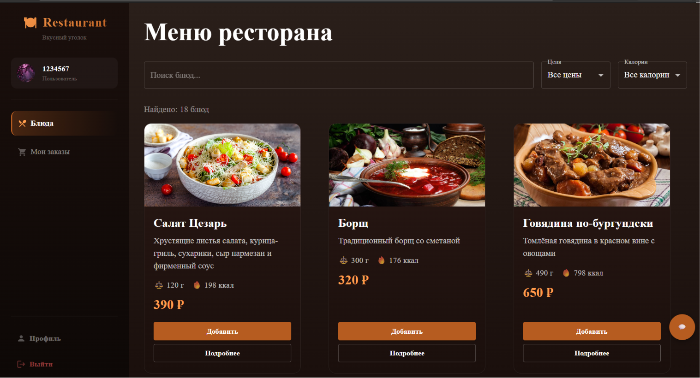
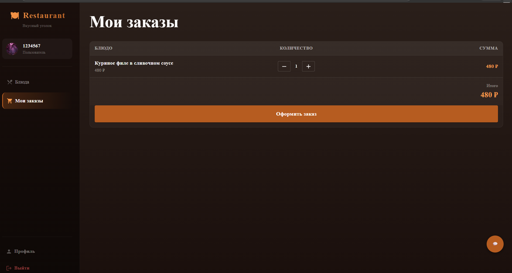
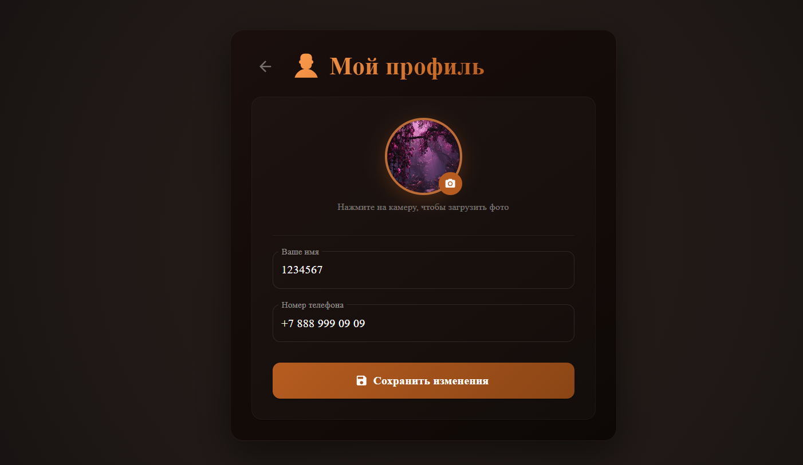
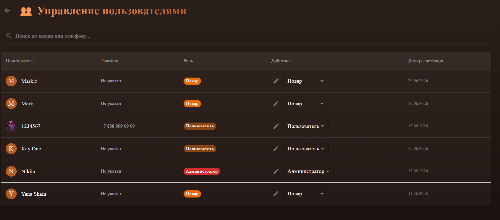
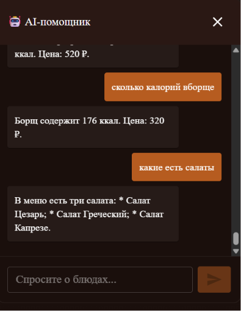

# 🍽️ Restaurant Menu App

Интерактивное веб-приложение для управления меню ресторана с функциями заказа, управления продуктами и AI-помощником.


## 📋 О проекте

Учебный проект для практики современных технологий веб-разработки. Приложение позволяет:

- Просматривать меню ресторана с карточками блюд
- Добавлять блюда в корзину и оформлять заказы
- Управлять продуктами (CRUD)
- Редактировать профиль пользователя (аватар, имя, телефон)
- Администрировать пользователей (изменение ролей, редактирование профилей)
- Общаться с AI-помощником для консультации по меню

---

## 🛠️ Технологии

| Технология | Назначение |
|------------|------------|
| **React 18** | Интерфейс пользователя |
| **Vite** | Сборка проекта |
| **Material-UI (MUI)** | UI-компоненты и стилизация |
| **Supabase** | Аутентификация, база данных (PostgreSQL), Storage |
| **React Router v6** | Маршрутизация |
| **OpenAI / DeepSeek API** | AI-помощник |
| **Docker** | Контейнеризация |

---

## 📁 Структура проекта
```bash
restaurant-menu-app/
├── public/ # Статические файлы
├── server/ # Серверная часть (AI-помощник)
│ ├── chat.js
│ └── index.js
├── src/
│ ├── api/ # Клиентские API-запросы
│ │ └── chat.js
│ ├── assets/ # Изображения и ресурсы
│ ├── components/ # React-компоненты
│ │ ├── AdminFab.jsx
│ │ ├── AIChat.jsx
│ │ ├── CreateDishDialog.jsx
│ │ ├── CreateProductDialog.jsx
│ │ ├── DishCard.jsx
│ │ ├── DishDetailsDialog.jsx
│ │ ├── DishGrid.jsx
│ │ ├── EditDishPriceDialog.jsx
│ │ ├── EditProductDialog.jsx
│ │ ├── EditUserProfileModal.jsx
│ │ ├── MenuDialogs.jsx
│ │ ├── OrderCheckoutModal.jsx
│ │ ├── OrderItem.jsx
│ │ ├── OrdersGrid.jsx
│ │ ├── ProductCard.jsx
│ │ ├── ProductsGrid.jsx
│ │ ├── RecipeDialog.jsx
│ │ ├── Sidebar.jsx
│ │ ├── sign-in/ # Компоненты входа
│ │ └── sign-up/ # Компоненты регистрации
│ ├── hooks/ # Кастомные хуки
│ │ ├── useDishes.js
│ │ ├── useOrders.js
│ │ └── useProducts.js
│ ├── pages/ # Страницы
│ │ ├── MenuPage.jsx
│ │ ├── ProfilePage.jsx
│ │ ├── SignIn.jsx
│ │ ├── SignUp.jsx
│ │ └── UsersPage.jsx
│ ├── shared-theme/ # Тема и стили
│ ├── utils/ # Утилиты
│ │ └── uploadAvatar.js
│ ├── App.css
│ ├── App.jsx
│ ├── index.css
│ ├── main.jsx
│ ├── supabaseClient.js
│ └── theme.jsx
├── .dockerignore
├── .env # Переменные окружения (заглушки)
├── .env.local # Реальные ключи (не в Git!)
├── .gitignore
├── docker-compose.yml
├── Dockerfile
├── eslint.config.js
├── index.html
├── package-lock.json
├── package.json
├── README.md
└── vite.config.js
```

---

## 🚀 Запуск проекта

### 1. Клонировать репозиторий

```bash
git clone https://github.com/1angelina-bez4/restaurant-menu-app.git
cd restaurant-menu-app
```
2. Установить зависимости
```bash
npm install
```
3. Настроить переменные окружения
Создайте файл .env.local в корне проекта:

env
VITE_SUPABASE_URL=https://ваш_проект.supabase.co
VITE_SUPABASE_ANON_KEY=ваш_публичный_ключ
VITE_OPENAI_API_KEY=sk-proj-ваш_ключ
4. Запустить сервер разработки
```bash
npm run dev
```
Откройте http://localhost:5173

🐳 Запуск через Docker
```bash
docker compose --profile dev up --build
```

## 📊 Роли пользователей

| Роль | ID | Возможности |
|------|----|-------------|
| **Пользователь** | 1 | Просмотр меню, добавление в корзину, оформление заказов, AI-чат |
| **Администратор** | 2 | Полный доступ: управление блюдами, продуктами, пользователями, ролями |
| **Повар** | 4 | Управление составом блюд и продуктами |

---

## ✨ Основные функции

# 🍽️ Меню
- Карточки блюд с изображением, описанием, ценой и весом
- Добавление в корзину (для пользователей)
- Управление блюдами (для админа)
- Редактирование состава блюда (для повара)

 

# 🛒 Корзина / Заказы
- Добавление и удаление блюд
- Изменение количества порций
- Оформление заказа с указанием адреса и телефона
- История заказов

 

# 👤 Профиль
- Изменение имени и телефона
- Загрузка аватарки (JPG, PNG, WEBP)
  
 


# 👥 Управление пользователями (админ)
- Просмотр всех пользователей
- Изменение ролей (Пользователь / Администратор / Повар)
- Редактирование профилей пользователей



# 🤖 AI-помощник
- Консультация по блюдам
- Информация о составе и калориях
- Помощь в оформлении заказа 



---

## 🗄️ База данных (Supabase)

### Схема таблиц

| Таблица | Поля | Назначение |
|---------|------|------------|
| `roles` | `id`, `name` | Роли пользователей (админ, повар, пользователь) |
| `profiles` | `id`, `full_name`, `role_id`, `avatar_url`, `created_at`, `phone` | Профили пользователей |
| `dishes` | `id`, `name`, `description`, `price`, `created_at`, `image_url`, `totalweight` | Блюда в меню |
| `products` | `id`, `name`, `weight`, `calories`, `price`, `created_at`, `image_url` | Продукты для блюд |
| `dish_products` | `id`, `dish_id`, `product_id`, `amount` | Связь блюд и продуктов (количество) |
| `cart_items` | `id`, `user_id`, `dish_id`, `quantity`, `created_at` | Корзина пользователей |
| `orders` | `id`, `user_id`, `total_price`, `status`, `address`, `phone`, `comment`, `created_at` | Заказы |
| `order_items` | `id`, `order_id`, `dish_id`, `quantity` | Позиции заказа |
| `agent_chats` | `id`, `user_id`, `agent_id`, `message`, `role`, `created_at` | История чатов с AI |
| `agent_actions` | `id`, `agent_id`, `name`, `description`, `action_type`, `config`, `created_at` | Действия AI-агента |

---

---

## 📌 TODO

- [x] Откорректировать работу помощника
- [ ] Добавить историю заказов для пользователя
- [ ] Добавить пагинацию для меню и продуктов
- [x] Добавить фильтрацию и поиск в меню
- [ ] Добавить уведомления о статусе заказа
- [ ] Добавить онлайн-оплату
- [ ] Добавить поставшиков
- [ ] Добавить работу менеджера
- [ ] Добавь вход как гостя
- [ ] Тёмная/светлая тема — переключение между темами
- [ ] Анимации переходов — плавные переходы между страницами
- [ ] Время доставки — выбор интервала доставки
- [ ] Чек-лист готовности — для повара: отметка о готовности блюда
- [ ] Способ оплаты — наличные / карта / онлайн
- [ ] Сброс пароля — через email
- [ ] Подтверждение email — верификация при регистрации
- [ ] Отзывы и оценки — пользователи оценивают блюда
- [ ] Курьер — новая роль с доступом к списку заказов на доставку
- [ ] Дашборд для админа — статистика: количество заказов, выручка, популярные блюда
- [ ] Отчёт по продажам — за день/неделю/месяц
- [ ] Графики и диаграммы — визуализация данных
- [ ] Экспорт в Excel/CSV — выгрузка отчётов
- [ ] Push-уведомления — о статусе заказа

